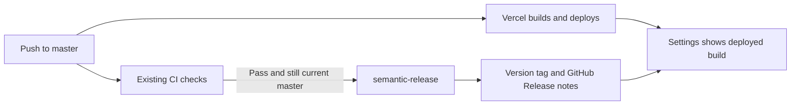

# Deployment, versions and release notes

## Existing deployment stays in charge

Vercel's GitHub integration continues to deploy pushes to `master` to production and other branches to previews. `vercel.json` is unchanged. There is no second deployment workflow, Vercel API token, automated version-bump commit, npm publication or extra release PR.

Vercel deployment and GitHub release creation are independent. Release success means CI passed and the source was tagged; it does not prove deployment or the user journeys passed. Existing automatic deployment is not gated on CI by this change. Prefer pull requests with required CI checks before merging; direct pushes to `master` retain today's behavior.

## What happens after a push

1. Existing `CI` runs formatting/lint, types, tests and the production build.
2. `.github/workflows/release.yml` responds only to a successful `push` CI run on `master` in this repository. PR events cannot run privileged release code.
3. The workflow checks out the tested commit and all tags. It skips superseded commits; the next successful current-master release includes all unreleased commits. Rapid pushes may be consolidated rather than creating a release for every intermediate commit.
4. Pinned `semantic-release` reads Conventional Commits, chooses a version, tags the exact commit and publishes categorized notes under GitHub → Releases.
5. Settings displays the running Vercel commit immediately and matches it to its semantic version once the tag exists. `/api/version` exposes the same metadata. `/api/health` retains its database-free build-identity behavior.

### Commit convention

| Commit | Release |
| --- | --- |
| `fix: Correct payment proof` | Patch, e.g. 1.2.3 → 1.2.4 |
| `feat: Add game reminders` | Minor, e.g. 1.2.3 → 1.3.0 |
| `feat!: Change the game contract` or `BREAKING CHANGE:` footer | Major, e.g. 1.2.3 → 2.0.0 |
| `docs:`, `ci:`, `chore:`, `test:`, `refactor:`, `style:`, `build:` | Patch; included in notes |

The largest change since the last release wins. Use a Conventional Commit title when squash-merging a PR. Nonconforming messages may not trigger a release; existing commit hooks remain authoritative. With no preceding release tag, semantic-release starts at **v1.0.0**, covering the existing history. This is a numbering baseline, not public-release clearance. Subsequent notes contain only changes since the previous release.

Git tags are the version source of truth. The private app's `package.json` version remains its development placeholder, avoiding bot commits, repeated Vercel builds and release loops. No manually maintained `CHANGELOG.md` is needed; GitHub Releases is the requested changelog destination.

## Version awareness

Settings has a quiet App version footer, using the existing Settings section spacing, semantic text colors and ordinary external-link affordance. The server component is suspended so GitHub lookup does not block the rest of Settings. It adds no client polling or dependency to the game flow.

- Example: `Relay v1.2.3 · Build aceb1d33d49c` with a link to that release's notes.
- Before a release exists, or if GitHub is unavailable: `Relay · Build aceb1d33d49c` with View releases.
- Preview deployments explicitly say Preview. Local development is labeled separately.
- Version lookup compares the full running commit SHA with GitHub tag commit SHAs; it never assumes the latest release is the deployed version. This remains safe after a Vercel rollback.
- GitHub lookup is server-side, cached for five minutes and bounded by a 2.5-second timeout. The repository is public, so no GitHub token is exposed or required at runtime. The lookup considers the first 100 tags returned by GitHub; very old rollbacks outside that window still show their accurate build ID.
- New tags can take a cache refresh and page reload to appear. A browser tab already open on an older deployment keeps its current view until refreshed.

## Activation

Commit and push these files after the repository's pre-commit gate. No extra deployment secret is required: GitHub's automatically supplied `GITHUB_TOKEN` has job-scoped `contents: write` for tags and releases; Vercel already supplies `VERCEL_GIT_COMMIT_SHA` and `VERCEL_ENV`.

Ensure repository/tag rules permit GitHub Actions to create `v*` tags. Do not grant branch-protection bypass or add a personal token merely to force a release. The workflow does not push commits to `master`.

On the first successful CI run after merging the workflow, verify:

1. Actions → Release finishes successfully for the tested commit.
2. GitHub → Releases contains its version and categorized notes.
3. Production `/api/health` identifies the expected deployed commit.
4. Production Settings and `/api/version` identify that same commit and, after cache refresh, its matching version.

The regression tests exercise exact-commit matching, graceful fallback, preview labeling and the installed commit analyzer's patch/minor/major rules. Use the matching Actions run and production build identity as activation evidence.

## Failure and recovery

- CI fails: no release is published; investigate CI. The existing independent Vercel deployment may already have happened.
- Vercel fails or rolls back: GitHub's release history stays intact, while Settings continues to identify the build actually running. Inspect Vercel's deployment status before treating a release as live.
- Release fails: inspect Actions → Release and rerun it after resolving the reported failure. Do not delete published tags as a routine retry. If a tag was created but GitHub Release publication failed, verify that tag's exact commit and restore the missing release notes before considering the release complete.
- API limit/outage: the app keeps its build ID and usable Settings; it never invents a release number.

## Research and choices

- [semantic-release overview](https://semantic-release.gitbook.io/semantic-release): standard fully automatic commit analysis, SemVer tags and release notes.
- [Commit analyzer rules](https://github.com/semantic-release/commit-analyzer): explicit major/minor rules preserve priority while other Conventional Commit types receive patch releases.
- [GitHub release plugin](https://github.com/semantic-release/github): publishes notes; issue/PR comments and failure issues are disabled because release automation does not need to message people.
- [Release Please](https://github.com/googleapis/release-please-action): considered, but its release-PR merge step adds an extra action to the requested push-to-master workflow.
- [Vercel Git deployments](https://vercel.com/docs/git/vercel-for-github): preserve the existing integration rather than duplicating deployment ownership.
- [GitHub repository tags API](https://docs.github.com/en/rest/repos/repos#list-repository-tags): public, commit-specific version lookup without a runtime credential.
