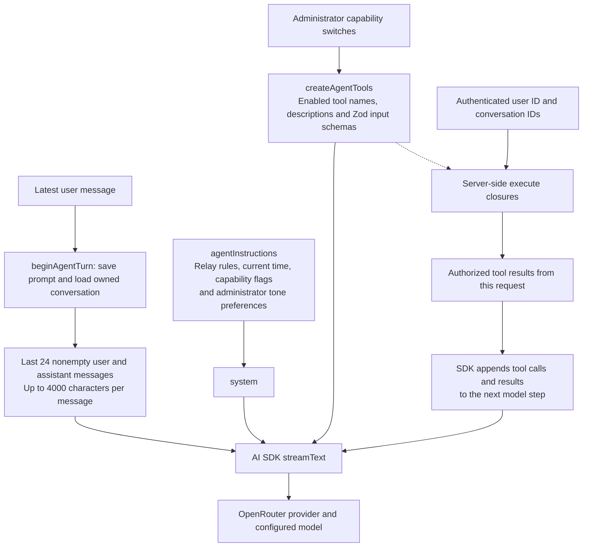
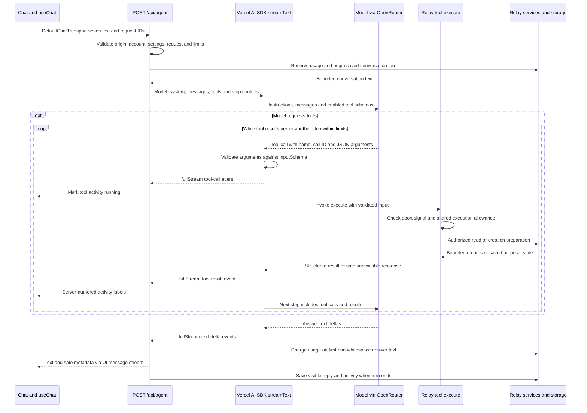

# How Relay Agent works

Relay Agent answers questions about a signed-in player's games, groups, courts, and the Help Center. When an administrator enables creation, it can collect details for a game, group, or local Quick Play and show a review card. Only the player's explicit approval through Relay's confirmation endpoint can complete a creation. The available tools and monthly allowance depend on the current Agent settings and account plan.

## What a player sees

1. Sign in and open `/agent`. An MFA-authorized administrator must first configure and enable Agent at `/admin/agent`; game, court, Help Center, and creation capabilities have separate switches.
2. Ask a question directly or use the `+` or `/` menu. Explore inserts an editable prompt; Create starts conversational setup. The menu only shows enabled capabilities.
3. Agent streams an answer and displays a short activity log. A creation setup asks for one missing detail at a time and saves the answers in the conversation. A completed setup shows a server-owned review card.
4. Review the exact details and select the approval button to create the result, or edit/cancel the proposal. Typing “yes” does not approve it. History lets the player reopen, rename, or delete saved conversations.

## Agent pipeline

Relay uses Vercel AI SDK's `streamText` to run a bounded tool loop inside `POST /api/agent`. OpenRouter connects that loop to the configured model. The model chooses a tool and supplies arguments, while the SDK validates those arguments and invokes Relay's server-side `execute` function. Relay's services enforce access and return the data used in the next model step.

### What goes into the model context

For a saved chat, the server rebuilds message context from its owned conversation record and the latest submitted prompt. A request without `conversationId` uses the validated client text messages instead. Neither path accepts client system messages or tool results. Identity and conversation IDs are bound into server functions for authorization and proposal storage, rather than accepted as model-selected authorization arguments.

Creation tools also require both conversation and message IDs, plus an enabled creation capability.

Raw tool calls and results stay in the current request's model context. History stores visible user/assistant text and safe activity metadata, and only the text is fed back as conversation context on a later turn. The model must fetch current application facts again through tools. Creation drafts are stored separately and recovered with `creationStatus`.

### One request and its tool loop

This is the successful saved-chat path. A step is one model generation and may contain multiple tool calls, so six steps does not mean six tools. `stopWhen: isStepCount(6)` caps model steps, and `prepareStep` removes tools on step six so the model can answer. A shared wrapper permits at most twelve tool operations, and the abort signal combines client cancellation with a 50-second deadline. `maxOutputTokens` comes from settings and `maxRetries` is zero. Text can also stream during earlier steps, not only after the last tool result.

For example, “Which games am I joining this weekend?” can produce `searchGames` with `scope: "joining"` and a date range. The SDK validates the input, then `execute` calls `searchAgentGames(userId, input)` using the server-bound identity. Its results enter the next model step, where the model can answer with the returned game links or request more permitted details. The model chooses this sequence dynamically.

The route consumes `result.fullStream` and constructs its own `createUIMessageStreamResponse`. It forwards answer text and safe activity labels to `useChat`, while keeping raw tool arguments, results, provider metadata and reasoning out of the browser stream. On failure or cancellation it saves available text/activity, marks the turn interrupted, and releases an uncharged usage reservation.

### Creation approval is a separate request

`prepareCreation` can save setup answers and a review proposal during the tool loop. Its `execute` function cannot create the final game or group. The player presses the review card's approval button, which calls `POST /api/agent/creations` with the proposal ID. That endpoint rechecks ownership, expiry, capabilities and eligibility before executing the product command. This is Relay's persisted proposal workflow, not the SDK's built-in tool-approval mechanism. Quick Play starts in the browser after confirmation.

Source: [`route.ts`](../src/app/api/agent/route.ts), [`chat.tsx`](../src/features/agent/chat.tsx), [`instructions.ts`](../src/features/agent/instructions.ts), [`history.ts`](../src/features/agent/history.ts), [`tools.ts`](../src/features/agent/tools.ts), and [`provider.ts`](../src/features/agent/provider.ts). SDK loop behavior was checked against the installed `ai` package's tool-calling docs and `stream-text.ts` implementation.

An activity label or model answer is not proof that a game or group was created. The saved proposal's completed status and destination link establish the result. If a reply is interrupted, History and the creation card show the saved state.

## Code and libraries

| Part | Implementation |
| --- | --- |
| Chat UI | `src/features/agent/chat.tsx`, `session.tsx`, and `runtime.tsx` use AI SDK chat transport and retain an active reply while navigating within the same tab. |
| Request boundary | `src/app/api/agent/route.ts` validates origin, account, settings, limits, and request shape, then streams text and safe activity metadata. |
| Model and tools | `provider.ts` uses the OpenRouter AI SDK provider; `tools.ts` registers bounded, server-owned reads and creation preparation through AI SDK `streamText`. |
| Data access | `reads.ts`, `courts.ts`, and `help.ts` return limited projections from authorized services and the shared Help Center catalog. |
| Creation | `creation-service.ts` prepares durable review proposals; `/api/agent/creations` handles owner-scoped status, confirmation, cancellation, and setup updates. |
| Credentials and state | `credentials.ts` encrypts the OpenRouter key; `config.ts`, `history.ts`, and `usage.ts` manage global settings, conversations, and message allowance. |
| Contracts | `validation.ts` and `creation-schema.ts` validate model inputs and creation details with Zod. |

Dependency versions are in [`STACK.md`](../STACK.md). [`agent/README.md`](agent/README.md) documents limits and deployment; [`agent/CAPABILITIES.md`](agent/CAPABILITIES.md) is the current creation and approval contract.

## Model tools versus product actions

Relay gives the model a small set of tools selected by administrator switches:

| Capability | Tools | What they can return or prepare |
| --- | --- | --- |
| Games and groups | `searchGames`, `gameDetails`, `myGroups` | Upcoming games, an authorized game and visible roster, or the player's groups. |
| Courts | `searchCourts`, `courtDetails` | Relay directory entries, access details, and public court links; no live booking or device location. |
| Help | `helpIndex`, `searchHelp`, `readHelp` | Articles from the same Help Center catalog used by the app. |
| Creation | `creationOptions`, `creationStatus`, `prepareCreation` | Eligible sources, trusted saved state, and an owner-scoped setup or review proposal. These tools do not execute the creation. |

The server binds the signed-in player ID to each tool. Model input supplies only validated filters, IDs, or creation details; it cannot choose another user, run SQL, browse arbitrary URLs, send messages, or call an unrestricted product command. Reads use existing permission rules and limited output fields. Missing and unauthorized details share an unavailable response. There is no vector database or separate Help Center index.

The server permits at most six model steps and twelve tool executions per request, with a 50-second generation deadline. The last step has no active tools so the model can finish its answer. Server-authored activity summaries cross the stream; raw tool arguments and results, provider metadata, and model reasoning do not.

## Creation and approval

When enabled, Agent can prepare these results. The catalog in `capabilities.ts` keeps Create choices alongside Explore prompts. Existing game and group commands supply the actual hosted writes and enforce normal permissions and quotas.

| Create choice | Result after approval |
| --- | --- |
| Create a game | A hosted game under the normal creation rules. |
| Save a game draft | A hosted game saved as a draft. |
| Replay a game | A new game based on an eligible completed game the player hosted. |
| Create a group game | A new game for a group the player belongs to. |
| Create a group | A new group under the player's account. |
| Save a game's crew | A new group from an eligible completed game's Going players. |
| Start Quick Play | A device-local play session; no account game is created. |

`prepareCreation` saves collected answers or an immutable review preview in `agent_creation_proposals`. It asks for one missing detail per reply. Corrections cancel the old pending proposal and generate a new one. Incomplete setup expires after 24 hours; a finished review expires after 30 minutes. The card displays the exact schedule, visibility, participation, payment intent, audience, and draft or publication effect where relevant.

The confirmation request contains a proposal ID, not model-authored fields. The server rechecks the signed-in player, owner, expiry, current Agent switches, account status, product eligibility, and whether source data still matches the reviewed preview. A locked proposal and the product command commit the destination with the completed state; a repeated confirmation returns that saved result. Stale, cancelled, expired, or changed previews require a fresh review. For Quick Play, confirmation marks the proposal complete, then the browser writes the local session and opens `/play`; replacing an existing local session requires explicit confirmation. Stopping the model response is separate from cancelling a proposal.

## Data, safety, and failure states

- Admins configure one OpenRouter key and model for Relay. The key is encrypted server-side with AES-256-GCM using `AGENT_ENCRYPTION_KEY`; the admin UI receives only whether a key exists. Strict provider privacy routing is the default, with an explicit administrator option for provider-policy routing.
- The server requires same-origin requests, a valid active account, an enabled Agent, an hourly per-user rate limit, and a monthly plan allowance. Requests are bounded to 24 text messages, 4,000 characters per message, and a 600 KB body. Client messages cannot set the system role, tools, user identity, or provider.
- PostgreSQL stores owner-scoped conversations, visible answers, bounded activity summaries, creation proposals, and message usage. Direct browser-role access to Agent tables is revoked. Unsent drafts stay in browser memory. Questions and selected authorized data are sent to OpenRouter and its selected model provider.
- A message counts against the monthly allowance when non-whitespace answer text begins. A failure or cancellation before that point releases its reservation. A partial answer after text begins counts once.
- Stop, disconnect, or deadline aborts further generation. A database read already underway may finish. Failed or interrupted turns preserve available conversation state without exposing upstream errors or raw tool payloads.
- Agent answers are untrusted text. Markdown rendering skips raw HTML and images and only turns permitted relative Relay source paths into links; destination pages check authorization again.

Source and unit tests establish the implemented contract. `e2e/agent-chat.spec.ts` uses a synthetic browser fixture and does not prove a live OpenRouter call or cross-account permissions in a deployed environment. A configured-provider smoke test and authenticated journey remain separate verification steps.

## Performance

Saved-chat requests send the latest user prompt; the server still rebuilds the
same bounded conversation context from owned history. React batches stream updates
at 50 ms and reuses unchanged rendered answers. Help search can include one matching
authoritative article so the model need not request that same guide again.

The [performance assessment](agent/PERFORMANCE.md) explains the latency boundaries,
opt-in aggregate timing diagnostics, preserved guarantees and remaining live
measurement gaps.
