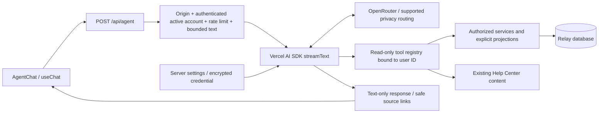

# Agent V1

Agent answers questions about Relay games, rosters, groups, open games and the existing Help Center. It is read-only and disabled until an MFA-authorized administrator configures it.

## Product and scope

- `/agent`: ephemeral conversation, streaming text, suggestions, source links, Stop, Retry and New chat. Desktop sidebar and mobile header provide entry points.
- `/admin/agent`: enable/disable, write-only OpenRouter credential replacement/removal, searchable model IDs, behavior instructions, game/help capability switches, per-user hourly limits, output-token limits and monthly Free/Plus/Pro message allowances.
- Upcoming game searches include published/live games whose end time is still in the future. They do not include drafts or archived history. Details can explain an authorized historical game when its ID is supplied.
- Joining means Going, not invited, pending, Maybe or waitlisted. Attention means outstanding invitations/pending requests and hosted-game booking, fewer than four confirmed players, or pending-approval needs. It is not a payment or complete readiness audit.
- Dates in search filters use Asia/Manila, consistent with Open games discovery. Results also include the game's stored timezone. The assistant explains relative date ranges and asks for clarification when context is ambiguous.
- No writes, actions, arbitrary SQL, code execution, browser, external URL retrieval, email, payment details, private notes or administrative tools are registered.

Agent uses the shared outlined Phosphor Cursor mark in `agent-mark.tsx` across chat, navigation, admin and marketing. The landing hero links to a dedicated Agent showcase after the existing Highlights.

## Architecture

Files under `src/features/agent` separate request validation, configuration/credential handling, read services, tools, instructions and client UI. The installed AI SDK 7 uses `isStepCount`, `inputSchema` and `TextStreamChatTransport`; use the installed declarations when extending it. OpenRouter uses its official AI SDK provider.

The registry binds the authenticated user ID in its closure. No tool accepts a user ID or a connection/query/provider setting. Queries use Drizzle parameters and fixed predicates; the model supplies only validated filters or a record ID. `gameLibraryMembership`, `publicDiscoveryCondition` and `getSessionForWorkspace` are the existing reference implementations. Group queries mirror the membership gate on `/groups/[slug]`.

`readAgentGame` rejects removed memberships before invoking workspace logic. Its projection additionally hides pending/invited players from non-organizers and removes left players. Explicit output fields exclude raw profile/session objects, emails, tokens, hashes, payment accounts, notes and internal source paths.

## Tools

| Tool | Purpose | Boundary |
| --- | --- | --- |
| `searchGames` | Mine, hosting, joining, attention, public open or group games | Authenticated membership/host or existing public discovery/group membership predicates; 20 per page, offset at most 200 |
| `gameDetails` | Details and permitted roster | Workspace permission plus removed-membership guard; at most 100 visible roster names |
| `myGroups` | Group names, role and links | Current membership only; 20 per page |
| `helpIndex` | Discover article slugs/titles | Public Help Center content only |
| `searchHelp` | Keyword search | Existing Help Center search; up to 8 results |
| `readHelp` | Ground procedural answers in article text | Existing article fields, omitting internal `sources` and images |

Search results indicate truncation and next offset. The model is instructed to label partial answers. Tool failures return fixed, non-diagnostic messages and never imply no records exist. The same unavailable result represents missing and unauthorized details.

Help Center is the only product-instruction source. No vector store, embeddings, duplicated guide content or autonomous indexing job is needed for this corpus.

## Configuration and deployment

1. Review and apply `drizzle/0056_agent_settings.sql` and `drizzle/0057_agent_message_allowances.sql` with the normal migration workflow. It enables RLS and revokes Supabase Data API privileges from `anon`, `authenticated` and `service_role`; only the server database connection handles the table. The application does not migrate automatically.
2. Generate a 32-byte encryption key with `openssl rand -hex 32`. Set `AGENT_ENCRYPTION_KEY` in the server's secret store, never a `NEXT_PUBLIC_` variable. Use the same key across application instances and keep a secured backup separate from the database.
3. Open **Admin → Agent** using an allowlisted account with MFA. Enter a dedicated, budget-limited OpenRouter key and select a tool-capable model. The public model catalog is cached for one hour; if it fails, manual model ID entry still works. Catalog presence does not prove that a model has an eligible privacy provider or account access.
4. Configure allowed reads, optional public-facing tone guidance and limits. Enable only after setup. The form verifies that the stored key can be decrypted; it does not make a billable test call or certify provider credentials/model availability.
5. Verify Help Center grounding, actual game/roster permissions, cancellation, provider failure and quota behavior with disposable users and the selected provider before release.

The provider requests `require_parameters: true`, `data_collection: deny`, and `zdr: true`. There is no privacy-downgrading fallback: a model without a compatible provider fails with safe recovery copy. Review OpenRouter account logging settings and the selected provider's terms as part of deployment; these routing flags do not promise that Relay controls all third-party operational metadata.

Credentials use AES-256-GCM with random 96-bit nonces, authenticated version context and authentication tags. The UI receives only `hasKey`, never plaintext or ciphertext. Admin saves run in a transaction with a row lock and audit record; the audit contains enablement and credential-changed flags, not keys or instructions. Blank input preserves a stored key; removal is explicit. All form fields other than the credential are intentional admin-visible configuration.

For credential rotation, replace the OpenRouter key in the form. For encryption-key rotation, first disable Agent, replace the server encryption secret, then re-enter the provider key and enable after verification. The old ciphertext will no longer decrypt. Do not print keys or copy them into diagnostics. A missing/wrong encryption key fails closed.

## Security model and limits

Backend authorization and narrow data projections are the security boundary. Prompts reinforce behavior but are not treated as access control. Custom instructions are model-visible public-facing guidance; do not put confidential information in them. System-prompt secrecy cannot be guaranteed by an LLM, so no secrets or sensitive configuration are put in the prompt.

- Same-origin POSTs only, matching the actual request URL so production aliases and preview deployments work without trusting forwarded host headers.
- Valid Supabase session plus an existing unsuspended account and no forced password change.
- PostgreSQL-backed monthly plan allowances plus per-user hourly rate limits (default 30, configurable 1–120); no process-local quota state.
- Maximum 600 KB request body (including worst-case JSON escaping for the bounded conversation), 24 text messages and 4,000 characters per message. Clients cannot supply system/developer/tool roles, tool results, attachments, identity or provider settings. The optional UUID request identifier provides replay protection and does not grant access. Client assistant history is untrusted; tool reads establish current facts. The UI sends the latest 24 nonempty text messages and bounds each to 4,000 characters.
- At most six model steps, twelve tool executions, a 50-second generation deadline and no model retries. Output tokens are capped per step (default 1,200; 256–4,000). OpenRouter account spending limits remain the global monetary safeguard.
- Response streams contain text only. Reasoning, raw tool results and provider metadata are never sent to the client. Error handling never logs or echoes upstream errors that might include request bodies or authorization headers.
- Rendering escapes HTML and treats arbitrary links/images as inert text. Only narrow relative game/group/help links become navigation; destination routes enforce authorization again.
- Responses are private/no-store. Relay does not persist conversations, tool results or prompt/response telemetry. The browser retains the current chat only in memory. Questions and selected data are processed by OpenRouter and the selected model provider; the UI discloses this.
- Stop/disconnect/deadline cancel model work. An already executing database read may finish; cancellation prevents subsequent tool reads.

Titles/names and previous assistant text can contain prompt injection. They cannot create new tools or change authorization, but model answers may still be misleading. Users must check source records. The UI does not execute suggested actions, HTML or remote resources. User-supplied text can itself contain sensitive data; do not submit secrets to the assistant.

## Extending capabilities

1. Define the user-visible question and exact authorized data needed.
2. Reuse an existing domain read/permission predicate; add a focused service only where required.
3. Return an explicit minimal DTO; never spread database records into model context.
4. Add a Zod input schema, bounded result/pagination and sanitized errors. Bind identity on the server, not in model input.
5. Register the read tool in `tools.ts`, behind the appropriate capability switch.
6. Add tests for another user's IDs, removed members, restricted rosters, disabled tools, malicious input, empty/error and truncated results. Update the journey matrix and this document.

Do not add a generic database/HTTP tool, tool-name dispatch supplied by the client or unrestricted admin tool. Avoid a framework/registry abstraction until the actual number of capabilities needs it.

## Roadmap

- Validate the normal authenticated journey with a configured provider.
- Improve source-grounding evaluations and relevance based on real questions; add historical-game filtering or richer attention insights only when needed.
- Consider explicit conversation persistence/retention and spending dashboards with user consent and tenant-safe access.
- Future actions belong in a separate command service and registry. The model may propose a typed action, but the server must reauthorize it, validate current state, show an exact preview and require explicit user confirmation. Use expiring server-held confirmation records, idempotency and audited execution. Never treat model text or replayed chat history as confirmation. **No action infrastructure or execution is implemented in V1.**

## Coverage and status

Unit regressions are under `src/features/agent/*.test.*` and `src/app/api/agent/route.test.ts`. `e2e/agent-chat.spec.ts` uses a synthetic UI fixture/mocked provider response for responsive conversation, links, New chat and error feedback, plus an unauthenticated API case. It is not evidence of live provider integration or authenticated authorization isolation.

Run `pnpm check:full` before committing and record exact results in the PR. Browser execution remains opt-in. On 2026-09-15, migrations 0056 and 0057 were applied to the linked production database: both ledger entries, table RLS, revoked client grants, default-off enablement and 50/250/750 defaults were verified. The production Vercel encryption secret was provisioned securely. Production readiness still requires the application deployment, OpenRouter credential/model setup, disposable-user cross-account verification and provider smoke testing. No live provider request or browser validation has been performed.

## References

- [AI SDK streaming](https://ai-sdk.dev/docs/reference/ai-sdk-core/stream-text) and [chat transport](https://ai-sdk.dev/docs/reference/ai-sdk-ui/use-chat)
- [OpenRouter AI SDK integration](https://openrouter.ai/docs/guides/community/vercel-ai-sdk)
- [Linear agent interactions](https://linear.app/developers/agent-interaction)
- Existing Relay UI references: `DESIGN.md`, `docs/LINEAR_UI_REFERENCE.md`, shared Button/PendingSubmit controls and admin settings forms.

## Monthly message allowances

Defaults are **Free 50, Plus 250, Pro 750 messages per month**. They are live Agent entitlements configured in **Admin → Agent**, separate from immutable hosting-price/game/storage snapshots. Public pricing, landing, chat and Plan & billing use the same stored values. An admin change applies immediately to current accounts without resetting their existing usage. Zero disables a tier's Agent allowance. Unlimited hosting receives the configured Pro Agent allowance; it does not grant unlimited model spending.

A message is one submitted question/follow-up or regenerated answer that begins producing non-whitespace answer text. Internal tool calls are not extra messages. Failures and cancellations before answer text starts release their reservation. Partial answers, failures after answer text starts, and cancellations after it starts count once. Retrying a failed-before-text answer uses a new request ID and can succeed without a prior charge. Regenerating an answer already started consumes another message. New chat never resets usage.

Quota handling reuses `getAccountAllowance` and `lockBillingAccount` from billing, so it observes the same current account plan and usage window as hosting, without querying unrelated game/media usage totals. Free resets on the first calendar day in Philippine time. Paid terms use their existing `usageStartsAt`/`endsAt`, preserving already-consumed usage on upgrades, including Free usage carried into the initial paid period. Plan assignments without a paid term follow calendar months. There is no rollover. Expiry/downgrade follows existing billing resolution, never clears the message ledger, and clamps remaining allowance to zero if consumption exceeds the new allowance.

`agent_message_usage` stores only request ID, user ID, reservation time, status and expiration. It never stores question/answer text. A transaction takes the same account lock used by billing, counts charged messages plus unexpired reservations, and inserts a reservation before provider work. This prevents concurrent requests from both taking the last available message. A charge must succeed before the first answer text is streamed. Reservations expire after two minutes if the process crashes; expired reservations cannot be charged. Released/charged request IDs cannot be replayed. The table uses RLS with no client Data API privileges.

`GET /api/agent` returns only the signed-in active account's allowance, charged/reserved/remaining counts and reset date. The chat refreshes this summary after requests; Plan & billing also shows it. Monthly-cap responses are distinct from the hourly abuse throttle, and copy recognizes that in-progress answers can temporarily reserve remaining messages.

**Messages are the user-facing unit; they are not a cost unit.** Retain the hourly throttle, bounded history, tool-step/output limits and provider-side spending cap. An answer can invoke multiple model steps. Measure representative per-answer costs in OpenRouter before committing to margins or raising allowances; the 50/250/750 ladder is approved product configuration, not measured cost evidence.
