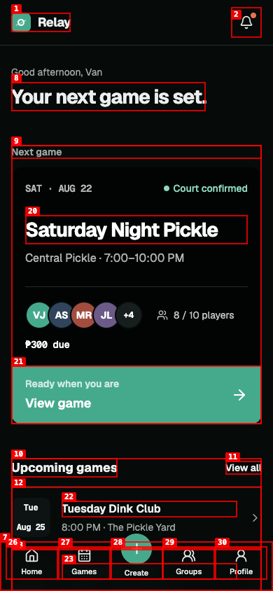
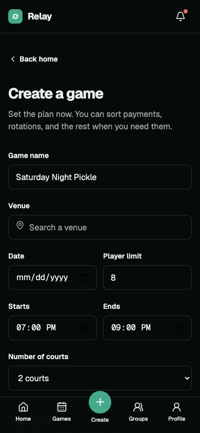
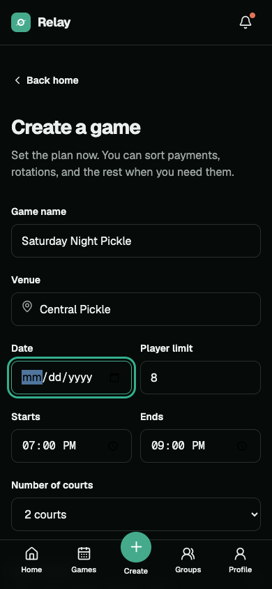
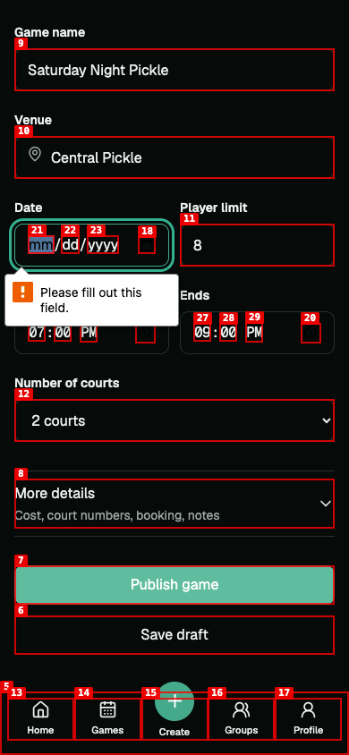
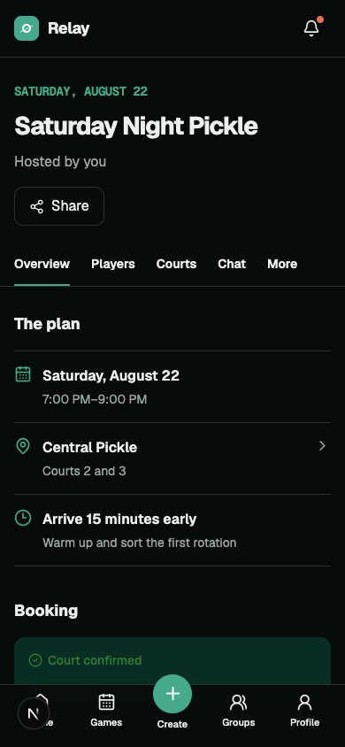

# Dogfood Report: Relay

| Field | Value |
|---|---|
| Date | 2026-08-15 |
| App URL | https://relay-pickleball.vercel.app |
| Session | relay-dogfood |
| Scope | Full consumer app; mobile-first core workflow |

## Summary

| Severity | Count |
|---|---:|
| Critical | 2 |
| High | 0 |
| Medium | 0 |
| Low | 0 |
| **Total** | **2** |

## Issues

### ISSUE-001: Unauthenticated visitors see a fabricated signed-in home

| Field | Value |
|---|---|
| Severity | critical |
| Category | functional / auth |
| URL | https://relay-pickleball.vercel.app/ |
| Repro Video | N/A |
| Status | Resolved in session-core slice |

**Description**

A fresh browser with no Relay session is greeted as “Van” and shown payment, notification, profile, and upcoming-session data. The authenticated shell should redirect to sign-in; only `/s/[slug]` should be public. This exposes misleading demo state and makes authorization impossible to trust.

**Evidence**

---

### ISSUE-002: Publishing a game does not persist or navigate

| Field | Value |
|---|---|
| Severity | critical |
| Category | functional |
| URL | https://relay-pickleball.vercel.app/games/new |
| Repro Video | videos/issue-002-repro.webm |
| Status | Resolved in session-core slice |

**Description**

The original create form was a visual mock: submission had no Server Action, no authorization, and no database write. The replacement validates server-side, creates the session, host roster entry and courts transactionally, and redirects to the real session workspace.

**Repro Steps**

1. Open Create game.
   
2. Enter a valid plan.
   
3. Submit and observe the unchanged form.
   

**Resolution evidence**

---
